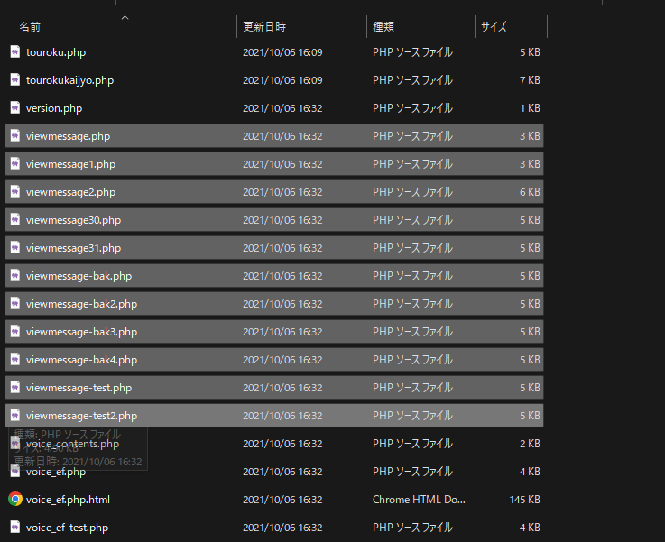

| プロジェクトメンバーが書いたソースコード      | main.py, utils.py, template.html, ... |
| ソースコードが直接呼び出す画像ファイル       | company_logo.png, top_img.jpg, ...    |
| プロジェクトメンバーが書いた開発者向けドキュメント | requirements.txt, readme.md, ...      |
| git 関連のファイル/ディレクトリ        | .gitignore, ...                 |

| データベース     | `*.sqlite3` | プログラマに顧客情報等を含む実データを渡したくない。 DBのバックアップは他で行う。 |
| ユーザ投稿画像     | `/media/*` | ユーザ投稿データのバックアップは他で行う。 |
| 仮想環境       | `venv`       | マシンのOS/Pythonバージョン等によって内容が異なることがある。 `readme.md`、 `requirements.txt` 等で、環境構築に必要な情報は提供する。 |
| IDEの設定ファイル | `.idea`, `.vscode`      | 人のマシンのPycharmの設定情報を持ってこられても困る。 自分のPycharmの情報が上書きされてしまう？ |
| 本番環境等への接続情報 | `.env`      | プログラマに余計な情報は渡したくない。 (不正アクセスのリスクになる) |
| 暗号化のための情報(シード値) | `.env`      | プログラマに余計な情報は渡したくない。 (不正アクセスのリスクになる) |
| プログラム実行時に生成される中間生成物     | `__pycache__`      | 各環境で `.py` 生成されるものなので除外 |
| ログファイル | `log.txt` | 他環境でのログを共有しても意味ない/他環境でのログと混ざるとかえってよくないので除外 |

# イントロダクション

## バージョン管理の必要性

「バージョン管理」ができていないと...。

「バージョン管理」によって実現が容易になること:

- 本番リリース用のソースコードと機能追加・開発用のソースコードは分けて扱いたい
	- 新機能の追加実装中なんだけど、本番環境でバグが発覚したので至急対応しなきゃ...
- 確実に動いていたあのときの状態に戻したい
	- いろいろいじっていたら分けが分からなくなったので、「あのとき」の状態に戻りたい
- 枝分かれして別々に行っていた作業を、切りの良いところで統合したい
	- デザイナーさんと協業したいときとか
- 履歴を確認したい
	- あのとき、どんな更新をしたっけ？
	- この問題が生じはじめたの、いつのどの更新からだろう？

***

## git とは

git は、バージョン管理システムの一つ。  
バージョン管理システムのデファクトスタンダード。

### 「DPR」で考える、git で管理するもの/管理しないもの

| 種別           | 扱い                       |
|--------------|--------------------------|
| git で管理するもの  | DPR でいう「P」のうちの、プロジェクトメンバーが書いたもの |
| git で管理しないもの | 上記以外                     |

### 「gitで管理するもの」の典型例:

| 種別                        | 例                                     
|---------------------------|---------------------------------------|
| プロジェクトメンバーが書いたソースコード      | main.py, utils.py, template.html, ... |
| ソースコードが直接呼び出す画像ファイル       | company_logo.png, top_img.jpg, ...    |
| プロジェクトメンバーが書いた開発者向けドキュメント | requirements.txt, readme.md, ...      |
| git 関連のファイル/ディレクトリ        | .gitignore, ...                 |

### 「gitで管理しないもの」の典型例:

以下は、個別に覚えるというより、「git で管理するものの典型例以外には、こんなのものがあるよね」という参考程度に見てください。

| 項目         | 例          | 考え方  | 
|------------|------------|---------------------------------------------------|
| データベース     | `*.sqlite3` | プログラマに顧客情報等を含む実データを渡したくない。 DBのバックアップは他で行う。 |
| ユーザ投稿画像     | `/media/*` | ユーザ投稿データのバックアップは他で行う。 |
| 仮想環境       | `venv`       | マシンのOS/Pythonバージョン等によって内容が異なることがある。 `readme.md`、 `requirements.txt` 等で、環境構築に必要な情報は提供する。 |
| IDEの設定ファイル | `.idea`, `.vscode`      | 人のマシンのPycharmの設定情報を持ってこられても困る。 自分のPycharmの情報が上書きされてしまう？ |
| 本番環境等への接続情報 | `.env`      | プログラマに余計な情報は渡したくない。 (不正アクセスのリスクになる) |
| 暗号化のための情報(シード値) | `.env`      | プログラマに余計な情報は渡したくない。 (不正アクセスのリスクになる) |
| プログラム実行時に生成される中間生成物     | `__pycache__`      | 各環境で `.py` 生成されるものなので除外 |
| ログファイル | `log.txt` | 他環境でのログを共有しても意味ない/他環境でのログと混ざるとかえってよくないので除外 |

- 情報セキュリティの三要素:  
	- 機密性（confidentiality）業務に必要な最低限の権限以上は提供しないようにする
	- 完全性（integrity）
	- 可用性（availability）

「gitで管理しないもの」のファイルパターンは、 .gitignore というファイルに記述しておく。
